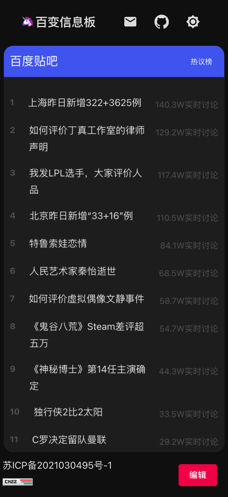

# 随意定制化内容的信息板 —— 百变信息板

基于 react 搭建

## 产品预览

## 开始体验

访问域名

[产品地址]([www.jinmai.store](https://www.jinmai.store/))

或：观看视频介绍

[bilibili视频地址](https://www.bilibili.com/video/BV1VF411u7tZ/)

## 产品介绍

百变信息板支持内容的个性化定制，随意拖拽与布局，看自己最想看的内容。产品内含有一个信息组件库，

可以从中选择内容进行定制

产品支持夜间、白天模式的切换

产品支持移动端的适配

## 产品开发相关

typescript 编写

web框架：react（hook全量使用）

状态管理：react-hook

网络请求：axios

UI框架：material-ui react 版

时间处理：moment

原子 css 支持：tailwindcss

style 定义：styled-component

组件懒加载机制：require.default api

拖拽库：react-grid-layout

动画库：lottie

服务端框架：nestjs

程序服务部署：腾讯云 serverless

## 有没有朋友一起干事情的哇 🤩

想提供内容推广或整合意向的，可以联系

邮箱：1067408814@qq.com
